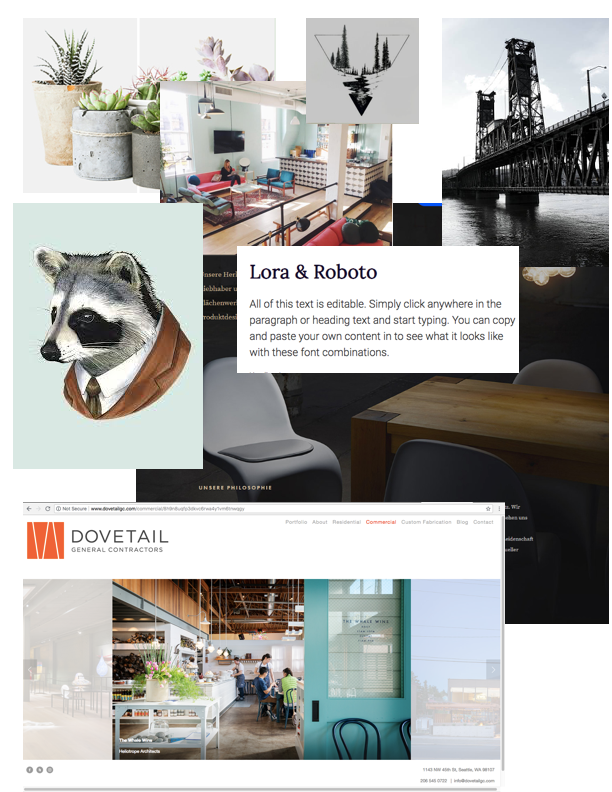
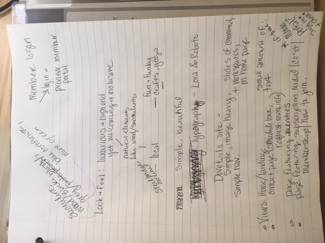
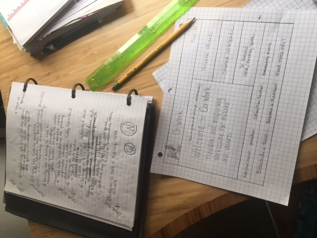

# _workspace-design_

#### _Code review project week 2 and 3 of User Interfaces at Epicodus, a school for tech careers. This is a design concept for a client who is opening a new office and workspace building. Design process is followed and documented throughout project and shown here in this README and in the attached sketch files.  2018_

#### By _Julianne Soifer_

### Co-Working Startup Web Design project

## Target Users:
*Potential Members who are currently looking for workspace to rent, from single desk/office to office suites.
*Local professionals who need occasional meeting space downtown
*Sales and Marketing team at Co-Working Startup.

## User Stories:
*As a small business owner, I want to quickly assess the atmosphere of this building and decide if the space is inline with our brand.
*As a small business owner, I am looking for amenities for my employees like good coffee, and nice views.
*As an attorney from a nearby city, I am looking for occasional hourly meeting space that I can easily schedule on short notice.
*As the manager of a satellite office, I have specific requirements and need to know if I can configure space in a customized way.
*As the manager of a satellite office, I will need high tech AV equipment in meeting rooms to facilitate virtual meetings and presentations.
*As a partner in a creative firm, natural light is very important. I want to see a lot of pictures of the space.
*As a partner in a creative firm who plans to stay long term, I want to hear from other members and get a feel for the community in the shared spaces.
*As a freelance professional, I want to see the small space options. Low-cost desk space and hourly meeting space are important to me.
*As the head of a non-profit, I will have fluctuating space needs. I will be interested in scheduling and paying for ala carte meeting and workspace.
*As the head of Sales and Marketing at Co-Working Startup, I expect this website to introduce our product to our future community of artists, daytraders, craftspeople, writers, engineers, and other makers and doers in an way that invites them to imagine how much they and their team would enjoy coming to work in our space.
*As the head of sales and marketing at Co-working startup I want every request for more information or a tour to collect contact information and initiate an immediate dialog with a member of my team. I do not want to miss an opportunity to connect with a potential new member.
*As an admin at Co-working Startup, I want simple and secure data collection and storage.
*As an Admin at Co-working Startup, I want meeting space scheduling and payment processing in an integrated member portal.

## Inspiration/Planning:
>Here are some images illustrating my inspiration and brainstorming session.  I really love the simplicity and image heavy design of Dovetail's website. I think a modern and clean color scheme with dark woods and black/charcoal offset with blush, mint, and soft blues would compliment the company's design esthetic and look beautiful in digital display.

>Here is where I ended the day Friday: a little more brainstorming and a preliminary layout sketch for the homepage.

## Setup/Installation Requirements

## Specs

## Known Bugs

## Support and contact details

_juliannesoifer@gmail.com_

## Technologies Used

### License

*Licencend under the MIT license*

Copyright (c) 2018 **_Julianne Soifer_**
